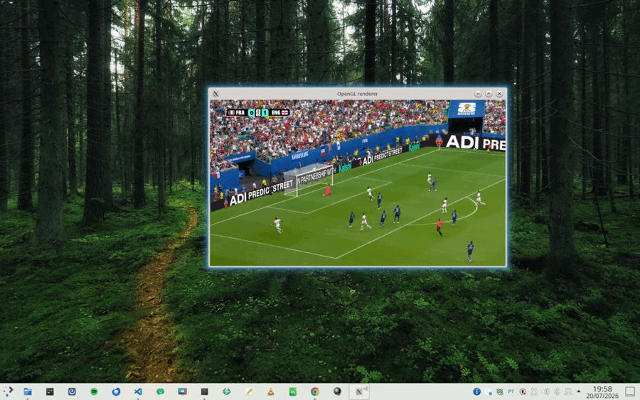
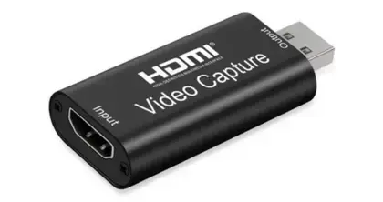

# HDMI USB Capture

Scripts to detect and preview using cheap USB HDMI capture devices using GStreamer. Tested with MacroSilicon-based devices. You can either run a **live preview** locally on the machine connected to the capture device over USB, or run an **RTSP server** to stream the capture over the network (optionally with a local preview).

<p align="center">
  <br>
  <em>hdmi-usb on Ubuntu</em>
</p>

**AI Agent Integration**: The **`hdmi-usb-screenshot-mcp`** helper runs an **[MCP](https://modelcontextprotocol.io/) server** on stdio while the RTSP stream is up; agents call **`get_last_frame`** to receive a **current** HDMI view as a 640×360 PNG (base64). Each tool call runs a short **`gst-launch-1.0 uridecodebin`** burst and returns the newest PNG from that burst so the image tracks the live screen.

<p align="center">
  <br>
  <em>unexpensive Generic HDMI-USB capture card</em>
</p>

## Features

- **Auto-detection** of MacroSilicon USB Video devices
- **Audio support** - automatically detects and uses audio from capture device
- **Local display window** - live preview
- **RTSP streaming** - scripts to show live video capture on the screen of the local machine and/or to stream live video/audio over network
- **MCP frame grabber** - `hdmi-usb-screenshot-mcp` exposes the live RTSP frame over MCP stdio
- **Window state** - automatically saves and restores window position

## Usage

### Continuous Capture (Video Preview / Streaming)

#### Live Preview

Start a live preview window showing the HDMI capture. You can use either:

**Direct Python script:**
```bash
./hdmi-usb.py
```

**Wrapper script with automatic device recovery:**
```bash
./hdmi-usb
./hdmi-usb --debug
```

The `hdmi-usb` wrapper script automatically detects the capture device, attempts recovery if the device is in a bad state (USB reset or module reload), and runs the preview in the background. Use `--debug` to see output, otherwise it runs silently.

Use `--help` for more options.

#### RTSP Streaming

Stream HDMI capture over RTSP for remote viewing or recording using the unified server (`hdmi-usb.py`). The server includes a local preview window by default.

```bash
# Start RTSP server with local display (default)
python3 hdmi-usb.py

# Start without local display window
python3 hdmi-usb.py --headless

# Optional: force audio from a specific ALSA card (best-effort)
AUDIO_FORCE_CARD=1 python3 hdmi-usb.py

# Show app debug logs and/or GStreamer debug logs
python3 hdmi-usb.py --debug
python3 hdmi-usb.py --gst-debug

# Diagnose audio cuts: audio-sync trace to ~/.cache/hdmi-usb/gst-audio-debug.log
python3 hdmi-usb.py --gst-debug-audio

# Trim lip-sync in the preview window (milliseconds)
python3 hdmi-usb.py --av-offset -60
```

### Lip-sync in the local preview

Capture and playback latencies vary with the capture stick, the sound card and
the compositor, and GStreamer cannot query them, so a residual offset between
the preview picture and the sound is expected. `--av-offset` trims it:

- **negative** delays the video, for when the picture runs ahead of the sound
- **positive** delays the audio, for the opposite case

Find the value by eye — start around ±50 ms and halve the step each time the
error changes sign. It applies to the preview window only; RTSP clients carry
proper timestamps and sync on their own. The flag is ignored when no audio
device is in use.

**Default RTSP URL:** `rtsp://127.0.0.1:1234/hdmi` (server listens on `0.0.0.0:1234`)

**Connect with ffplay (recommended):**
```bash
ffplay -rtsp_transport tcp rtsp://127.0.0.1:1234/hdmi
```

**Connect with GStreamer:**
```bash
gst-launch-1.0 rtspsrc location=rtsp://127.0.0.1:1234/hdmi ! decodebin ! autovideosink
```

**Note:** VLC may have compatibility issues with RTSP SETUP requests. Use ffplay or GStreamer instead.

Use `--help` for more options.

### MCP frame server (`hdmi-usb-screenshot-mcp`)

**Python 3** + GStreamer command-line tools (no PyPI packages). Start the RTSP server first (for example, `./hdmi-usb --debug` or `python3 hdmi-usb.py`), then run:

```bash
./hdmi-usb-screenshot-mcp
./hdmi-usb-screenshot-mcp -u rtsp://127.0.0.1:1234/hdmi --debug
```

The process speaks **MCP** on **stdin/stdout** (JSON-RPC 2.0). **Cursor and MCP 2025-03-26** use **newline-delimited JSON** (one object per line); **Content-Length** framing is still accepted for older clients. Replies use the same framing as the client’s first message. The server answers MCP requests immediately. Each **`get_last_frame`** call launches a short **`gst-launch-1.0 uridecodebin`** capture, writes a burst of PNG frames into a temporary directory, and returns the newest one so the snapshot reflects the live HDMI view. **Stderr** is for logs and errors only.

The RTSP server in **`hdmi-usb.py`** uses a **small leaky `queue`** before **`decodebin`** in the factory pipeline so encoded output stays close to the HDMI source (restart the server after upgrading for that change).

CLI flags: `--url` / `-u`, `--debug` / `-d` (see `--help`). Environment: `RTSP_URL`.

Example Cursor `mcpServers` entry (include `PYTHONUNBUFFERED` so stdio stays responsive):

```json
{
  "mcpServers": {
    "hdmi-screenshot": {
      "command": "/path/to/hdmi-usb-screenshot-mcp",
      "env": {
        "RTSP_URL": "rtsp://127.0.0.1:1234/hdmi",
        "PYTHONUNBUFFERED": "1"
      }
    }
  }
}
```

## Installation

`./install.sh` copies **`hdmi-usb.py`**, **`hdmi-usb`**, and **`hdmi-usb-screenshot-mcp`** into **`~/.local/bin`**, ensures **`~/.local/bin`** is on **`PATH`**, and **merges** a **`hdmi-screenshot`** entry into **`~/.cursor/mcp.json`** (command `~/.local/bin/hdmi-usb-screenshot-mcp`, env **`RTSP_URL`** and **`PYTHONUNBUFFERED=1`**). Re-run it after pulling changes; then **reload MCP** in Cursor.

### Dependencies

Install required packages on Ubuntu:

```bash
sudo apt update
sudo apt install gstreamer1.0-tools gstreamer1.0-plugins-base \
  gstreamer1.0-plugins-good gstreamer1.0-plugins-bad \
  gstreamer1.0-plugins-ugly gstreamer1.0-libav gstreamer1.0-gl \
  v4l-utils wmctrl x11-utils alsa-utils python3 \
  gir1.2-gst-rtsp-server-1.0 python3-gi

# Optional: Install ffplay for RTSP client testing
sudo apt install ffmpeg
```

**Note:** The scripts use only Python standard library modules and require no PyPI packages.

## Testing

`test_hdmi_usb_screenshot_mcp.py` spawns **`hdmi-usb-screenshot-mcp`**, runs `initialize` / `ping` / `tools/list` / `tools/call` for `get_last_frame`, and checks that the returned base64 decodes to a valid PNG. Requires an **already running** RTSP server (default URL `rtsp://127.0.0.1:1234/hdmi`).

```bash
python3 test_hdmi_usb_screenshot_mcp.py
python3 test_hdmi_usb_screenshot_mcp.py --frame-wait 60 --debug-child
```

`integration-test.sh` is a best-effort integration test that installs the scripts into `~/.local/bin`, then exercises the most important user-facing flows.

**Covered:**
- Installation via `install.sh`
- Python GI imports for GStreamer / RTSP server
- `--reset-window` behavior (clears saved window state)
- RTSP server starts and listens on `127.0.0.1:1234`
- Local preview window move/resize and window state save/restore (requires X11 + `wmctrl` + `xwininfo`)
- `test_hdmi_usb_screenshot_mcp.py` against the running RTSP server (MCP stdio)
- Headless mode (`--headless`) + same MCP test

**Not covered (by design):**
- Wrapper preflight/recovery (`hdmi-usb` USB reset / `uvcvideo` reload paths)
- Audio device matching and ALSA sharing (`dsnoop`/`plughw`)
- Instance-kill behavior and orphan process cleanup
- `--gst-debug` log behavior
- `--width` forced local viewer sizing (window managers vary; can be flaky to assert)

## Window State

Window position and size are automatically saved and restored between sessions. Use `--reset-window` to clear saved state.

Window state is stored at `${XDG_CONFIG_HOME:-~/.config}/hdmi-usb/window-state` (legacy installs may have `~/.hdmi-rtsp-unified-window-state`, which is migrated automatically). The path does not depend on the directory the app is started from.

The window is always kept at a 16:9 aspect ratio. Resizing it by hand snaps it back, adjusting the side you did not drag: change the width and the height follows, change the height and the width follows. When both change at once (corner drag, maximize), whichever correction is smaller wins. The same applies when `--width` is used, in which case the geometry is neither restored nor saved.
